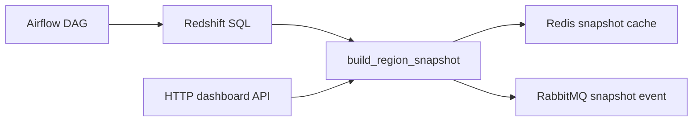

# regionflow-be

[](https://github.com/regionflow-data/regionflow-be/actions/workflows/ci.yml)

지역별 주문 신호를 집계해 수요 지수와 재고 액션을 만드는 Python 분석 백엔드입니다.

## 도메인 맥락

지역별 주문 수요는 재고 운영과 배송 운영의 공통 입력입니다. RegionFlow BE는 Airflow/Redshift 경계에서 생성된 신호를 받아 지역별 스냅샷으로 정규화합니다.

## 엔트리포인트

| 파일 | 설명 |
| --- | --- |
| `dags/regionflow_daily.py` | Airflow 일간 파이프라인 |
| `src/regionflow/pipeline.py` | 지역 스냅샷 생성 로직 |
| `src/regionflow/api.py` | 대시보드 API |
| `sql/redshift_region_mart.sql` | Redshift 집계 SQL |

## 처리 흐름

- 주문, 품절, 배송 시간 신호 수집
- 지역별 수요 지수 계산
- 품절률이 높은 지역은 `rebalance-inventory`

## 기술 스택

- Python
- Airflow
- Redshift SQL
- Redis, RabbitMQ
- Pytest

## 아키텍처



## 실행

```bash
PYTHONPATH=src python3 -m pytest
PYTHONPATH=src python3 -m regionflow.api
```

샘플 요청: [`requests.http`](./requests.http)  
API 계약: [`openapi.yaml`](./openapi.yaml)

## 테스트

- `test_high_stockout_region_is_flagged`: 품절률 액션 검증
- `test_region_snapshots_are_grouped_and_sorted_by_demand`: 지역 그룹/정렬 검증
